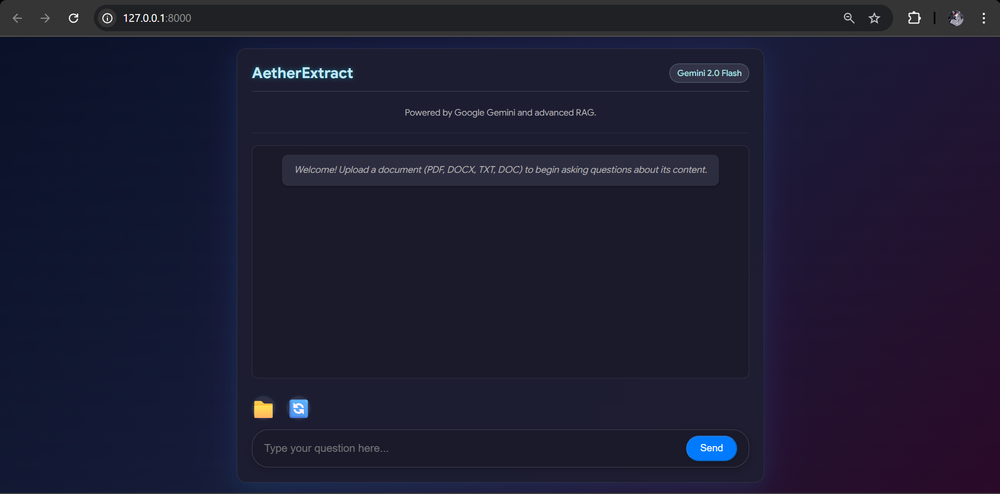

# AetherExtract

Unleash the knowledge from your documents with AetherExtract -- an intelligent chatbot powered by Google Gemini and advanced Retrieval Augmented Generation (RAG).



## Key Features

- **Multi-Document Support**: Upload and query PDF (.pdf), Word (.docx, .doc), and Text (.txt) files.
- **Intelligent Q&A**: Get accurate, contextual answers directly from your uploaded documents.
- **Gemini-Powered**: Leverages Google's powerful Gemini 2.0 Flash model for natural language understanding and generation.
- **Retrieval-Augmented Generation (RAG)**: Efficiently retrieves relevant information from your documents using FAISS vector store.
- **Dynamic Response Length**: Ask general questions for concise answers (3-5 sentences) or explicitly request "details" for comprehensive explanations.
- **Source Transparency**: Always shows the top relevant source paragraph for transparency.
- **Aurora-Themed UI**: A sleek, dark, and aesthetically pleasing interface inspired by the night sky.
- **Reset Functionality**: Easily clear the current document and chat history to start fresh.

## Tech Stack

### Backend
- **FastAPI**: High-performance web framework for the API.
- **LangChain**: Framework for building LLM applications (integrates Gemini, FAISS, and text processing).
- **Google Gemini API**: Large Language Model (LLM) for answering questions and generating embeddings.
- **FAISS**: (Facebook AI Similarity Search) For efficient similarity search in vector stores.
- **pypdf**: For text extraction from PDF files.
- **python-docx**: For text extraction from .docx (Word) files.
- **docx2txt**: For text extraction from older .doc (Word) files.
- **python-dotenv**: For secure management of API keys.
- **Uvicorn**: ASGI server to run the FastAPI application.

### Frontend
- **HTML5**: Structure of the web interface.
- **CSS3**: Styling for the unique aurora theme and responsive layout.
- **JavaScript (ES6+)**: Handles user interaction, API calls to the backend, and dynamic content updates.

## Setup Instructions

Follow these steps to get your AetherExtract chatbot up and running on your local machine.

### 1. Prerequisites
- **Python 3.8+**: Make sure you have a compatible Python version installed.
- **Google Gemini API Key**: Obtain an API key from Google AI Studio or your Google Cloud Console.
- **Antiword (for .doc files)**: If you plan to process .doc files, you might need to install antiword on your system.
  - On Debian/Ubuntu: `sudo apt-get install antiword`
  - On macOS (with Homebrew): `brew install antiword`
  - On Windows: Download and install `antiword.exe` and add it to your system's PATH.

### 2. Clone the Repository
```bash
git clone YOUR_GITHUB_REPO_URL_HERE
cd mini_rag_chatbot
```


### 3. Create and Activate Virtual Environment
```bash
python -m venv venv
# On Linux/macOS:
source venv/bin/activate
# On Windows:
.\venv\Scripts\activate
```

### 4. Install Dependencies
```bash
pip install -r requirements.txt
```
### 5. Set up your Gemini API Key
Create a .env file in the root directory:

```env
GOOGLE_API_KEY="YOUR_GEMINI_API_KEY_HERE"
```
Ensure there are no spaces around the = sign.
 
## ▶️ How to Run
### 1. Start the Backend Server

```bash
uvicorn app.main:app --reload
```
Leave this terminal open; the server will keep running.

2. Open the Frontend in Your Browser
Go to:

```cpp

http://127.0.0.1:8000/
```
You should now see the AetherExtract chatbot interface.

## 💡 Usage Examples & Demonstrations

Here are some examples of AetherExtract in action. Ensure you upload a suitable document (like the sample AI/ML content provided previously) for these queries.

### 1. Initial Load & Document Upload

This GIF demonstrates launching the chatbot and successfully uploading a document.


(Description: Shows the browser loading http://127.0.0.1:8000/, then the user clicking the folder icon, selecting a document file, and seeing the "Document processed successfully!" message.)

### 2. Concise Response Example

This GIF shows how AetherExtract provides brief, 3-5 sentence answers for general questions.


(Description: User types "What is Artificial Intelligence?", hits Send. Chatbot responds with a concise overview of AI and a single source.)

### 3. Detailed Response Example

This GIF highlights AetherExtract's ability to give comprehensive answers when more detail is requested.


(Description: User types "Explain in detail the different types of machine learning.", hits Send. Chatbot responds with a multi-paragraph explanation of supervised, unsupervised, and reinforcement learning, and a single source.)

### 4. Reset Functionality & Out-of-Context Handling

This GIF demonstrates clearing the chatbot and its appropriate response to questions outside the document's scope.


(Description: User clicks the 🔄 (reset) button, confirms reset. Chatbot clears. User then types "What is the capital of France?", hits Send. Chatbot responds with "I cannot find the answer to that question in the provided document.")


## 🧪 Test Queries for Your Chatbot

Upload your 5-6 page AI/ML sample document (or a similar relevant document) and try these queries:

### General/Concise Response Test (Default 3-5 Sentences):

"What is Artificial Intelligence?"

"Define Machine Learning briefly."

"Explain deep learning simply."

### Detailed/Comprehensive Response Test (Explicitly Asking for Detail):

"Explain in detail the different types of machine learning."

"Provide a comprehensive explanation of how Computer Vision works."

"Summarize the future directions of AI research in detail."

### Specific Information Extraction:

"Who introduced the Turing Test and when?"

"What is the role of the Transformer architecture in NLP?"

"List some common tasks in Computer Vision."

### "I cannot find the answer" Test (Out of Context):

"What is the capital of France?"

"Who won the last Super Bowl?"

"Tell me about quantum physics."

## 📂 Project Structure
```
mini_rag_chatbot/
├── .env                    # Environment variables (e.g., GOOGLE_API_KEY)
├── app/
│   ├── main.py             # FastAPI backend application, serves frontend & API endpoints
│   └── rag_pipeline.py     # Core RAG logic: document processing, embeddings, LLM interaction
├── frontend/
│   ├── index.html          # Main HTML structure of the chatbot UI
│   ├── style.css           # CSS for styling and layout (Aurora theme)
│   └── script.js           # JavaScript for frontend interactivity and API calls
└── requirements.txt        # Python dependencies
```

## 🛠️ Troubleshooting
### ❗ ModuleNotFoundError or DefaultCredentialsError
- Ensure all packages in requirements.txt are installed:

``` bash
pip install -r requirements.txt
```
- Verify your .env file is in the root directory, and contains:

``` env

GOOGLE_API_KEY="YOUR_KEY_HERE"
```
Make sure there are no extra spaces or invalid characters.

- Confirm your API key is active and has permissions for:

 - gemini-2.0-flash

 - text-embedding-004 (Check this in your Google AI Studio dashboard)

### ❗500 Internal Server Error or “Could not extract text from the document”
- The document might be:

 - Image-only (scanned)

 - Encrypted

 - Corrupted

- Try using a digitally created .pdf, .docx, or .txt file first.

- For .doc files:

  - Ensure antiword is installed if docx2txt fails. (See setup instructions for installing antiword.)

### ❗429 Quota Exceeded
- You've hit your free-tier usage limits for the Gemini API.

- Wait for your quota to reset (check the reset time in your Google AI Studio).

- Consider upgrading or increasing quota on your Google Cloud project.
### ❗Frontend not loading (seeing raw JSON)
- Make sure you are navigating to:

```cpp
http://127.0.0.1:8000/
```
Do not open /upload-document or /chat directly in the browser.

 - Clear your browser cache if you don’t see updated CSS or JS changes.


